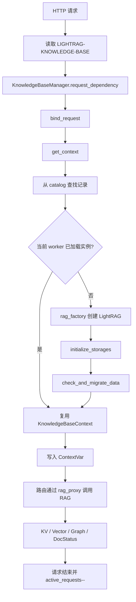

# LightRAG 多知识库 Audit Gap 深度分析

- 分析分支：`dev`
- 代码基线：`27e41a703f4f`
- 分析日期：2026-07-23
- 关联设计：[lightrag-rfc.md](./lightrag-rfc.md)

## 1. 这份文档解决什么问题

这份文档不是简单列出“还缺哪些功能”，而是回答四个更具体的问题：

1. 当前代码实际上是怎样把一次 API 请求路由到某个知识库的？
2. 已经实现的隔离能力到什么程度，哪些部分可以继续复用？
3. 每个 audit Gap 在代码层面究竟意味着什么？
4. 如果不补齐，在真实生产场景中会出现怎样的错误、数据泄漏或服务事故？

本文中的“灾难”表示在特定并发、配置或故障条件下可能发生的最坏结果，并不表示每次运行都会发生。很多 Gap 在单 worker、单知识库、无故障的演示环境中完全看不出来，只有进入多知识库、多 worker、后台任务和服务重启场景才会暴露。

## 2. 先建立当前代码模型

### 2.1 三个容易混淆的概念

当前实现中有三个不同概念：

| 概念 | 当前作用 | 示例 |
| --- | --- | --- |
| Knowledge-base ID | API 选择知识库时使用的公开 ID | `default`、`kb_a1b2c3d4e5f6` |
| Display name | WebUI/API 展示给用户的名称 | `财务制度库` |
| Effective workspace | 传给 `LightRAG` 和存储后端的隔离值 | `kb_a1b2c3d4e5f6` |

`KnowledgeBaseRecord` 是冻结 dataclass，包含上述 ID、名称和 effective workspace，见 `lightrag/api/knowledge_bases.py:95-137`。新建知识库时，当前 catalog 会生成 `kb_<12位hex>`，并令 `effective_workspace == id`，见 `lightrag/api/knowledge_bases.py:252-284`。

这是一个正确基础：用户可修改显示名称，但存储 namespace 不随名称变化，避免“知识库改名导致数据找不到”。

### 2.2 一次普通 API 请求的调用链

当前数据面的大致流程如下：



对应代码位置：

- Header 定义：`lightrag/api/knowledge_bases.py:37-50`
- 请求依赖：`lightrag/api/knowledge_bases.py:624-640`
- Context 绑定：`lightrag/api/knowledge_bases.py:611-622`
- 实例查找/创建：`lightrag/api/knowledge_bases.py:576-609`
- 存储初始化与迁移：`lightrag/api/knowledge_bases.py:551-574`
- 各 Router 挂载同一 dependency：`lightrag/api/lightrag_server.py:2248-2280`

### 2.3 一个 LightRAG 实例并不只有四个存储对象

概念上有四类存储，但一个实例会构造 12 个实际存储对象：

| 存储家族 | 实际对象 |
| --- | --- |
| KV | `llm_response_cache`、`text_chunks`、`full_docs`、`full_entities`、`full_relations`、`entity_chunks`、`relation_chunks` |
| Vector | `entities_vdb`、`relationships_vdb`、`chunks_vdb` |
| Graph | `chunk_entity_relation_graph` |
| Doc-status | `doc_status` |

这些对象都在 `LightRAG.__post_init__` 中接收 `workspace=self.workspace`，见 `lightrag/lightrag.py:1156-1228`。

所以“构造时把 workspace 传下去”已经实现。Gap 的关键不是没传，而是某些后端收到以后又按照自己的环境变量和默认值重新解释，导致最终值可能与实例值不同。

### 2.4 Pipeline 的基本工作方式

文档上传不是一次同步操作全部做完：

1. API 先保存文件或文本。
2. 在 `pipeline_status` 中预留 enqueue/pipeline slot。
3. 启动受管理的 `asyncio` 后台任务。
4. 后台任务写 `full_docs` 和 `doc_status`。
5. Pipeline 从 doc-status 查询 PENDING/PROCESSING/FAILED/PARSING/ANALYZING 文档。
6. 解析、分块、抽取实体关系、写向量、写图。
7. 所有派生存储 flush 成功后，最后把 doc-status 写成 PROCESSED。

Pipeline 会使用 `self.workspace` 获取独立的 `pipeline_status` 和 lock，见 `lightrag/pipeline.py:1080-1084`；会读取 in-flight 状态，见 `lightrag/pipeline.py:1154-1174`；处理中发现新请求时还会重新查询队列，见 `lightrag/pipeline.py:1270-1289`。

这说明单个已经正确绑定的实例，其 pipeline 主路径已经具备较好的 workspace 意识。Gap 主要发生在“谁来启动这个实例”“上下文活多久”“重启后谁主动发现它”和“doc-status 是否真的与其他存储落在同一个 workspace”。

## 3. 当前已基本满足的能力

在讨论 Gap 前，先明确哪些不是从零开始。

### 3.1 实例基本固定绑定 workspace

`build_knowledge_base_rag()` 从冻结的 catalog record 读取 `effective_workspace`，再调用 `build_rag(workspace=...)` 构造实例，见 `lightrag/api/lightrag_server.py:2108-2120` 和 `2197-2210`。

当前没有提供“把一个已运行实例切换到另一个 workspace”的管理 API。这比共享一个可变实例安全得多。

仍需加强的地方是：`LightRAG.workspace` 本身还是普通可变字段，存储后端也可能重写自己的 `workspace`。RFC 需要把“约定上固定”提升成“结构上不可变且可校验”。

### 3.2 Unknown ID 不会由数据面自动创建

`get_context()` 会先通过 `catalog.get()` 查找记录；不存在就抛出 `KnowledgeBaseNotFoundError`，最终转换成 404，见 `lightrag/api/knowledge_bases.py:242-250`、`576-592` 和 `624-640`。

好处是用户把 `kb_finance` 错写成 `kb_finanec` 时，不会悄悄创建一个空目录、空 collection 和一套数据库连接。

### 3.3 单 worker 内有 first-access single-flight 基础

Manager 使用 `_manager_lock` 防止并发创建两个 context，并使用每知识库 `_instance_locks` 防止同一 worker 重复初始化，见 `lightrag/api/knowledge_bases.py:414-417`、`551-561` 和 `593-608`。

这可以避免同一个 Python 进程中两个并发请求同时构造同一知识库。它不能解决不同 Gunicorn worker 同时初始化、迁移的问题。

### 3.4 Pipeline namespace 已显式带 workspace

`initialize_storages()` 为 `self.workspace` 初始化 pipeline-status，见 `lightrag/lightrag.py:1314-1336`。Pipeline 主路径也显式传入 `self.workspace`。

同主机多 worker 下已有 owner token、dead-process reservation reclaim 和共享并发 gate 等基础设施。这些是后续实现 lease/fencing 和 admission controller 的可复用基础，但目前还不是完整的 catalog 驱动、多知识库恢复与公平调度系统。

## 4. Gap 总览与优先级

| Gap | 当前程度 | 主要风险 | 建议优先级 |
| --- | --- | --- | --- |
| G1 Catalog 不是跨 worker 一致的控制面 | 部分实现 | 随机 404、lost update、孤儿数据 | P0 |
| G2 Pool 无安全 eviction，后台/流式 lease 不完整 | 部分实现 | 使用中实例被删、容量永久耗尽 | P0 |
| G3 缺失上下文仍可能回落 default | 部分实现 | 跨知识库误读误写且不报错 | P0 |
| G4 重启恢复不会主动遍历所有 workspace | 部分实现 | 非默认库任务永久卡住、恢复饥饿 | P1 |
| G5 四类存储 effective workspace 可能分裂或坍缩 | 高风险缺口 | 数据泄漏、doc-status 静默覆盖 | P0 |
| G6 空/default 的表示不一致且可能碰撞 | 高风险兼容缺口 | 新旧数据 namespace 冲突 | P0 |
| G7 Health 有副作用，迁移发生在首次访问 | 明确缺口 | 探针触发迁移、启动循环、请求超时 | P1 |
| G8 模型并发预算会随实例数放大 | 部分实现 | Provider 限流、成本和延迟雪崩 | P1 |
| G9 Ollama 的 model 不能选择 workspace | 明确缺口 | 标准客户端始终访问 default | P1 |

下面逐项展开。

## 5. G1：Catalog 不是跨 worker 一致的控制面

### 5.1 当前代码做了什么

`KnowledgeBaseCatalog` 的核心是：

- 进程内 `_records: dict` 保存全部记录；
- `threading.RLock` 保护当前进程内的读写；
- 启动时 `_load_or_create()` 读取一次 JSON；
- 修改后通过 `atomic_write()` 写临时文件并 `os.replace()`；
- `list()` 和 `get()` 后续只读取当前进程的 `_records`，不会自动刷新文件。

代码见：

- `lightrag/api/knowledge_bases.py:140-150`
- `lightrag/api/knowledge_bases.py:164-230`
- `lightrag/api/knowledge_bases.py:232-321`
- `lightrag/file_atomic.py:115-153`

`atomic_write` 解决的是“写一半进程崩溃，JSON 文件变成半截”的问题。它保证读者看到旧文件或完整新文件，却没有解决“两个 worker 基于不同旧快照同时更新”的问题。

### 5.2 用通俗方式理解

可以把 catalog 想象成办公室墙上的通讯录：

- Worker A 和 Worker B 开机时各自拍了一张照片。
- A 在自己的照片上增加“财务库”，然后把整张新通讯录贴到墙上。
- B 没有重新看墙，仍在旧照片上增加“法务库”，随后又把整张通讯录贴上去。
- 最后墙上只有“法务库”，“财务库”被覆盖掉了。

文件始终是完整 JSON，所以监控不会看到“文件损坏”；真正丢失的是一次合法更新。这叫 lost update。

### 5.3 可能发生的事故

#### 场景 A：同一个 ID 在不同 worker 上结果不同

1. 管理请求落到 Worker A，新建 `kb_finance`。
2. A 的内存 catalog 有该记录。
3. 下一次 query 被负载均衡到 Worker B。
4. B 的旧快照没有该记录，返回 404。
5. 用户刷新几次，可能一会成功、一会 404。

这种故障最难排查，因为它看起来像网络抖动，实际是进程内控制面不一致。

#### 场景 B：记录丢失但物理数据还存在

Worker A 已经为某知识库创建目录、表数据或 collection，随后 Worker B 的旧快照覆盖 catalog。物理数据仍占空间，但系统再也不知道它属于谁，形成孤儿数据。

#### 场景 C：删除与创建互相覆盖

一个 worker 删除记录，另一个 worker 基于旧快照重命名或创建，最终可能把已删除记录重新写回 catalog，或者丢掉新建记录。

### 5.4 当前生命周期还缺什么

当前 record 没有 `CREATING / MIGRATING / ACTIVE / DELETING / TOMBSTONED` 状态。管理 `POST /knowledge-bases` 只写 catalog 就返回 201，实际存储初始化和迁移留到第一次数据访问，见 `lightrag/api/routers/knowledge_base_routes.py:66-76`。

删除则先逐个 drop 存储，最后才删 catalog，见 `lightrag/api/knowledge_bases.py:700-723`。如果第 5 个存储 drop 失败，前 4 个可能已经被清空，但 catalog 仍看起来是正常记录；没有中间状态告诉用户“这是一个部分删除、不可继续使用的知识库”。

### 5.5 补齐后的好处

Shared durable catalog + revision/CAS 可以带来：

- 所有 worker 看到同一事实；
- 同时修改同一记录时，旧 revision 更新失败而不是覆盖别人；
- 用户能看到知识库正在创建、迁移、删除还是失败；
- 一个 worker 崩溃后，另一个可以根据持久状态接管；
- 未来扩展到多节点时不依赖 sticky session。

### 5.6 应如何验证

- 两个真实进程同时 create，最终两个记录都存在。
- 两个进程同时修改同一 revision，只允许一个成功，另一个收到 conflict。
- Worker A 创建后，Worker B 无需重启即可查询到。
- 在 CREATING/MIGRATING 状态访问数据面得到稳定 503，而不是触发第二次初始化。
- 删除中途故障后记录保持 DELETING/ERROR，不能假装 ACTIVE。

## 6. G2：Pool 无安全 eviction，后台/流式 lease 不完整

### 6.1 当前 pool 的结构

Manager 当前保存：

```text
_contexts: dict[knowledge_base_id, KnowledgeBaseContext]
_initialized_ids: set
_instance_locks: dict[knowledge_base_id, asyncio.Lock]
_max_loaded_instances: 默认 32
```

见 `lightrag/api/knowledge_bases.py:404-417`。

首次访问时，如果 `_contexts` 数量达到上限，直接返回 conflict；如果未达到则构造 context，见 `lightrag/api/knowledge_bases.py:591-609`。代码中没有 LRU、idle timeout 或 finalize-and-remove 的 eviction 路径。

### 6.2 “有上限”不等于“有资源管理”

假设上限是 32：

1. 运维人员依次查看了 32 个知识库。
2. 每个只查询一次，之后一天都不再使用。
3. 它们仍永久留在当前 worker 的 `_contexts` 中并保持数据库/Redis/Neo4j client。
4. 第 33 个知识库访问被拒绝。
5. 只有删除知识库或重启 worker 才能释放位置。

这像一个只能入住、不能退房的 32 间酒店。房间上限防止无限入住，但并没有形成可持续的池。

### 6.3 当前 active_requests 能保护什么

`bind_request()` 在进入路由前执行 `active_requests += 1`，退出 dependency 时减一，见 `lightrag/api/knowledge_bases.py:611-622`。删除知识库会检查这个计数，见 `lightrag/api/knowledge_bases.py:670-699`。

它能覆盖普通同步请求的大部分生命周期，但没有形成通用 lease：

- 没有 background lease；
- 没有 migration/recovery lease；
- 没有 future eviction lease；
- 计数增加与 deleting 检查不是同一个原子状态转换；
- 后台任务的真实生命周期可能长于 HTTP 请求。

### 6.4 后台任务为什么是特殊问题

上传接口会在请求内创建 `_indexing_work`，然后通过 `start_reserved_background_task()` 启动任务并立即返回“后台处理中”，见：

- `lightrag/api/routers/document_routes.py:3153-3187`
- `lightrag/api/routers/document_routes.py:3285-3318`
- `lightrag/api/routers/document_routes.py:3432-3465`

`asyncio.create_task()` 会复制当前 ContextVar，因此子任务通常还能找到正确的 `rag_proxy` target。这也是当前后台上传能够工作的原因。

但 HTTP 响应完成后，`bind_request()` 会把 `active_requests` 减回 0；后台任务可能还要运行几十分钟。Manager 并不知道“这个 context 仍被后台任务持有”。

Pipeline 的 busy/scanning/pending 状态对现有上传和删除提供了一部分额外保护，但这不是通用实例 lease：未来 eviction、模型流式任务、迁移任务、非 pipeline 后台任务或状态切换不一定检查同一组字段。

### 6.5 一个真实的删除竞态窗口

当前流程可能出现：

```text
请求 R: get_context() 检查 _deleting_ids，发现没有
                    ↓ 协程切换
删除 D: 把 ID 加入 _deleting_ids
删除 D: 看到 active_requests == 0，开始 drop storage
                    ↓ 协程切换
请求 R: active_requests += 1，开始使用已被 drop 的 storage
```

原因是 `get_context()` 中的 deleting 检查与 `bind_request()` 的计数增加不是同一个 lock 下的原子 acquire。

可能结果包括：

- 查询过程中 collection 被删除；
- 后台任务继续向已经 finalize 的连接写入；
- 一半存储 drop 成功、一半仍在使用；
- 用户收到随机 500，但更严重的是部分写入和数据状态不一致。

### 6.6 流式请求的风险

Query 和 Ollama 会返回 `StreamingResponse`，并可能再创建 query task，见 `lightrag/api/routers/query_routes.py:821-928` 和 `lightrag/api/routers/ollama_api.py:321-438`。

当前正确性依赖 FastAPI dependency、stream generator 和子任务的具体生命周期关系。架构上没有一个明确对象表示“只要这个 stream 还没关闭，实例就不能 eviction/finalize”。一旦框架版本、错误路径或新 Router 改变 teardown 时机，就可能释放得过早。

### 6.7 补齐后的好处

正确的实例池应让每类工作都显式持有 lease：

```text
foreground lease  普通请求
stream lease      流式响应
background lease  上传、扫描、删除、reprocess
migration lease   schema/data migration
recovery lease    重启恢复
deletion lease    排他删除
```

只有所有 lease 为 0、pipeline 空闲、没有 buffer 和迁移任务时，实例才可进入 DRAINING 并 eviction。

这样可以：

- 安全复用有限连接；
- 长期运行不会因为访问过 32 个知识库永久满池；
- 删除和 eviction 不会碰到仍在执行的任务；
- 容量不足时可明确返回 503 backpressure，而不是破坏工作。

### 6.8 应如何验证

- 用 barrier 固定在 `get_context()` 和 lease 增加之间，证明删除不能插入。
- HTTP 已返回但后台任务未结束时，删除/eviction 必须被拒绝。
- 流式客户端保持连接时，实例不可 eviction。
- 所有 idle context 达到阈值后，最旧且安全的实例被 finalize；第 33 个可以加载。
- 所有 context 都有 lease 时返回 503，不能超预算或取消在途工作。
- cancellation 只能释放一次 lease，不能出现负数或永久泄漏。

## 7. G3：缺失上下文仍可能回落 default

### 7.1 当前有三层 fallback

#### 第一层：Header 空值与缺失值被合并

`validate_knowledge_base_id()` 当前使用：

```python
normalized = (value or DEFAULT_KNOWLEDGE_BASE_ID).strip()
if not normalized:
    return DEFAULT_KNOWLEDGE_BASE_ID
```

见 `lightrag/api/knowledge_bases.py:324-330`。

因此以下请求语义相同：

```text
完全不传 header
LIGHTRAG-KNOWLEDGE-BASE:
LIGHTRAG-KNOWLEDGE-BASE:      （只有空格）
```

但产品语义上它们不应相同：

- 不传是为了兼容旧客户端，可以访问 default；
- 明确传空通常代表客户端 bug、代理丢值或变量未替换，应返回 400。

#### 第二层：RequestScopedProxy 回落 default_context

`RequestScopedProxy._target()` 当前逻辑是：

```python
context = _current_context.get() or self._manager.default_context
```

见 `lightrag/api/knowledge_bases.py:346-361`。

任何忘记挂 `context_dependency` 的新路由、脱离上下文的 callback 或错误创建的后台任务，都会悄悄使用 default，而不是暴露编程错误。

#### 第三层：shared_storage 的进程级默认 workspace

`get_final_namespace()` 在 `workspace is None` 时读取 `_default_workspace`，见 `lightrag/kg/shared_storage.py:145-158`。第一个初始化的 LightRAG 会调用 `set_default_workspace(self.workspace)`，见 `lightrag/lightrag.py:1322-1331`。

这是 SDK 单 workspace 兼容能力，但如果多知识库服务内部路径忘记显式传 workspace，就可能使用进程中第一个实例的 workspace。

### 7.2 为什么“自动帮你选 default”很危险

在单知识库程序中，fallback 很方便；在多租户/多项目服务中，它会把“代码缺陷”变成“成功访问错误数据”。

#### 案例：新 API 忘记挂 dependency

开发者新增 `/graph/export`，直接使用 `rag_proxy`，但忘了 Router dependency：

```text
用户请求 kb_customer_b
         ↓
没有 ContextVar
         ↓
proxy 自动使用 default
         ↓
接口 200，返回 default 的图
```

如果系统返回 500，测试和监控会马上发现；现在却返回一份格式正确、内容错误的数据，这是更危险的“静默成功”。

#### 案例：前端变量为空

前端本来要发 `kb_finance`，但状态初始化失败，发出空 header。当前代码把它当 default，上传文件可能直接进入默认知识库。用户之后在财务库找不到文件，却可能让默认库查询到敏感内容。

### 7.3 补齐后的好处

目标语义应是：

- Header 完全缺失：兼容 default。
- Header 存在但空：400。
- ID 非法：400。
- ID 合法但未知：404。
- multi-workspace 数据面缺少 concrete context：内部 typed error，绝不 fallback。
- legacy SDK 可继续使用独立、明确标识的兼容入口。

Fail-closed 的好处是把跨知识库数据错误变成可观察、可测试、可修复的显式失败。

### 7.4 应如何验证

- 对 absent、empty、whitespace、invalid、unknown 分别断言不同结果。
- 枚举所有数据面 route，移除任一路由 dependency 后测试应失败，而不是访问 default。
- 在没有 ContextVar 的 background callback 调用 proxy，必须抛出 typed error。
- 所有 pipeline/lock/status 调用在 multi-workspace 路径显式传 binding。

## 8. G4：重启恢复不会主动遍历所有 workspace

### 8.1 当前恢复能力“有但需要被触发”

Pipeline 被调用时，会查询以下状态：

```text
PROCESSING
FAILED
PENDING
PARSING
ANALYZING
```

定义见 `lightrag/pipeline.py:116-126`，查询见 `lightrag/pipeline.py:1154-1157`。一致性修复还会把被中断的状态重新归一到 PENDING，见 `lightrag/pipeline.py:1683-1737`。

所以只要某个 workspace 的 pipeline 被重新启动，它具备恢复未完成文档的基础。

问题在于服务启动时，`KnowledgeBaseManager.initialize()` 只初始化 default context，见 `lightrag/api/knowledge_bases.py:543-546`。非默认知识库只有被 `get_context()` 访问时才初始化，且没有启动任务遍历 catalog 并调用各 workspace 的恢复逻辑。

API 提供 `/documents/reprocess_failed`，但它也是用户触发的，见 `lightrag/api/routers/document_routes.py:4430-4509`。

### 8.2 shared pipeline recovery 的边界

当前 `shared_storage` 能在 Linux 多 worker 模式检测某些 dead PID owner，并在下一次 reservation 检查时回收 slot，见 `lightrag/kg/shared_storage.py:1742-1766`。

它有两个边界：

1. 它是“下一次操作触发的 reconciliation”，不是 catalog 范围的主动恢复。
2. 整个服务重启后，SyncManager 的内存状态消失；真正 durable 的恢复依据是各 workspace 的 doc-status，但当前没有全 catalog 扫描者。

### 8.3 可能发生的事故

#### 场景：凌晨批量导入后服务器重启

1. `kb_a` 有 100 个文档，50 个处理完，50 个仍 PENDING/PROCESSING。
2. `kb_b` 有 20 个文档，同样未完成。
3. 机器重启。
4. default 在启动时初始化，但 `kb_a`、`kb_b` 没有用户访问。
5. 两个知识库的 durable doc-status 一直保留未完成状态，却没有任何 pipeline 处理。
6. 第二天用户看到“处理中”长时间不变，只能逐库调用 reprocess。

这不是数据丢失，但属于 durable work 被永久搁置。

#### 场景：热门库挤压冷门库恢复

即使做了简单遍历，如果没有全局并发上限和 workspace 公平队列，拥有十万文档的 A 可能长期占满模型资源，让只有两个待恢复文档的 B 一直排不到。

### 8.4 补齐后的好处

Catalog-driven recovery coordinator 应：

1. 分页枚举所有 ACTIVE workspace。
2. 为每个 workspace 获取带 fencing token 的 recovery/pipeline lease。
3. 查询该 workspace 自己的 doc-status。
4. 回收 stale PROCESSING，归一为可重试状态。
5. 把任务放入全局公平 scheduler。
6. 记录扫描 cursor、失败和重试，避免一个坏库阻塞全部。

这样服务恢复不依赖“用户恰好先访问一次”，也不会因为大租户造成小租户永久饥饿。

### 8.5 应如何验证

- 准备多个 workspace 的 PENDING/PROCESSING 状态，完整重启后不发任何用户请求，最终都被恢复。
- 杀死一个 worker，确认新 owner 获得更高 fencing token；旧 owner 后续提交被拒绝。
- 一个 workspace 的存储故障不阻塞其他 workspace。
- 大量 A 工作存在时，B 在规定时间内获得调度。
- 重复执行 recovery 不产生重复 chunk、vector 或 graph mutation。

## 9. G5：四类存储 effective workspace 可能分裂或坍缩

这是整个 audit 中风险最高的 Gap。

### 9.1 构造时统一，后端解析时又分叉

LightRAG 确实把相同 `self.workspace` 传给 12 个存储对象。但各后端还有自己的 override：

| 后端 | Override |
| --- | --- |
| PostgreSQL | `POSTGRES_WORKSPACE` |
| MongoDB | `MONGODB_WORKSPACE` |
| Redis | `REDIS_WORKSPACE` |
| Neo4j | `NEO4J_WORKSPACE` |
| Milvus | `MILVUS_WORKSPACE` |
| Qdrant | `QDRANT_WORKSPACE` |
| Memgraph | `MEMGRAPH_WORKSPACE` |
| OpenSearch | `OPENSEARCH_WORKSPACE` |

能力表见 `lightrag/kg/storage_profiles.py:27-63`。

`resolve_workspace_override()` 在没有 physical storage profile 时直接读取环境变量，见 `lightrag/kg/storage_profiles.py:105-114`。MongoDB、Milvus、Qdrant、Memgraph、OpenSearch 等后端会据此覆盖传入 workspace；Neo4j 和 Redis 也有等价逻辑。

PostgreSQL 更明确地把优先级写成：

```text
PostgreSQLDB.workspace > storage self.workspace > "default"
```

KV、vector、doc-status 和 graph 分别在 `lightrag/kg/postgres_impl.py:2627-2639`、`3831-3843`、`4922-4934`、`6075-6087` 执行这个规则。

### 9.2 两类不同的灾难

#### 灾难类型一：坍缩 collapse

假设所有四类存储都用 PostgreSQL，并配置：

```text
POSTGRES_WORKSPACE=shared
```

服务创建两个实例：

```text
Instance A workspace=kb_a
Instance B workspace=kb_b
```

但每个 PG storage 初始化后都改成 `shared`。结果是：

```text
kb_a ─┐
      ├──> PG workspace=shared
kb_b ─┘
```

这意味着 A 和 B 看似是两个实例，实际读写同一份 full-doc、chunk、vector、graph 和 doc-status 数据。隔离在 API/实例层成立，在存储层完全失效。

可能后果：

- B 查询到 A 的文档和实体；
- A 删除文档会删除 B 的同 ID 数据；
- LLM cache 在不同客户之间复用；
- 相同内容 hash 的 doc-status 互相覆盖。

#### 灾难类型二：分裂 split-brain storage

混合配置更隐蔽，例如：

```text
KV             = PostgreSQL，POSTGRES_WORKSPACE=legacy
Vector         = Qdrant，无 override，使用 kb_b
Graph          = Neo4j，无 override，使用 kb_b
Doc-status     = Redis，REDIS_WORKSPACE=queue_shared
```

同一个 `LightRAG(workspace=kb_b)` 实际落点变成：

```text
full_docs / chunks -> legacy
vectors            -> kb_b
graph              -> kb_b
doc_status         -> queue_shared
```

Pipeline 可能在 `queue_shared` 中看到文档 PENDING，却去 `legacy` 查 full-doc；或者把 status 写成 PROCESSED，但 query 的向量空间根本没有对应数据。

这种故障常表现为：

- 文档显示已处理，但搜不到；
- retry 反复失败；
- delete 只删掉部分数据；
- 一次重启后状态突然“恢复”或“消失”；
- 同一 API 在不同存储组合下行为不一致。

### 9.3 为什么 doc-status 最危险

doc-status 是 pipeline 的 durable work queue，不只是展示字段。它记录：

- 文档是否 PENDING/PROCESSING/PROCESSED/FAILED；
- `track_id` 查询；
- 重试与恢复的依据；
- 文件路径、chunks list 和 attempt metadata。

文档 ID 通常来自 content hash。同一份《员工手册.pdf》分别上传到 A 和 B，可能得到相同 doc ID。

如果 doc-status 坍缩：

1. A 写入 `doc-xyz = PROCESSING`。
2. B 上传相同内容，写入同一个 `doc-xyz = PENDING`。
3. A 完成后写 `doc-xyz = PROCESSED`。
4. B 的 queue record 被 A 覆盖。
5. B 可能认为自己的文档已处理，但 B 的 vector/graph 根本没有写完。

这是静默覆盖；数据库不会报主键冲突，因为系统认为它是在更新同一条记录。

### 9.4 当前已有的局部保护

`KnowledgeBaseManager._profile_for()` 会在创建非 default logical 知识库时检查 active backend 对应的 override，并拒绝动态知识库，见 `lightrag/api/knowledge_bases.py:464-477`。

这是一项有价值的防护，但并不完整：

- default 实例不受该分支保护；
- 只检查环境变量存在，不验证每个真实 storage 对象最终解析值；
- 不能发现不同后端分别解析成不同值；
- 不能保护直接使用 LightRAG SDK 的多实例程序；
- health 中的 `_get_storage_workspaces()` 只展示四个代表值，不做 fail-fast，见 `lightrag/api/lightrag_server.py:473-503`。

现有测试 `test_all_twelve_storages_receive_the_effective_workspace` 使用 `_FakeStorage` 验证 factory 传参，见 `tests/api/test_knowledge_bases.py:170-184`；它没有让真实后端执行 override 解析，因此不能证明“最终 effective workspace 一致”。

### 9.5 补齐后的好处

目标设计需要：

1. Control plane 只解析一次 immutable canonical workspace binding。
2. Multi-workspace 模式启动时发现 active backend override 就报错，不能静默忽略。
3. 每个实际 storage 对象暴露统一 descriptor：family、role、canonical key、codec version、physical fingerprint。
4. 在 migration 和数据访问前检查全部 12 个对象。
5. 任意一个不一致都拒绝初始化，尤其 doc-status 不能降级为 warning。

这样可以把“处理几天后才发现数据混了”提前变成“服务启动时明确指出 REDIS_WORKSPACE 与实例绑定冲突”。

### 9.6 应如何验证

- 对每个 backend override 做参数化测试，multi-workspace 启动必须失败。
- 混合 PG KV + Qdrant vector + Neo4j graph + Redis doc-status，验证四族 key 相同。
- 两个 workspace 上传相同内容 hash，独立推进全部状态，不互相覆盖。
- 对 12 个 storage object 全量检查，而不是每族抽一个。
- backend 连接初始化后再次验证，防止 PG client 在 connect 阶段二次覆盖。

## 10. G6：空/default 的表示不一致且可能碰撞

### 10.1 当前不同后端怎样理解空 workspace

| 后端 | 空 workspace 的当前物理/对象表示 |
| --- | --- |
| 文件存储 | 直接使用 `working_dir`，不创建 workspace 子目录 |
| PostgreSQL | 变成字符串 `default` |
| PG graph | 空或字符串 `default` 都使用未加 workspace 前缀的 graph name |
| Redis KV | 使用未加前缀 namespace，`self.workspace=""` |
| Redis doc-status | 使用未加前缀 namespace，但 `self.workspace="_"` |
| Qdrant | `effective_workspace = "_"` |

证据位置：

- 文件 KV：`lightrag/kg/json_kv_impl.py:135-148`
- 文件 doc-status：`lightrag/kg/json_doc_status_impl.py:78-91`
- NetworkX：`lightrag/kg/networkx_impl.py:141-155`
- PostgreSQL：`lightrag/kg/postgres_impl.py:2627-2639`
- PG graph：`lightrag/kg/postgres_impl.py:6015-6038`
- Redis KV：`lightrag/kg/redis_impl.py:218-248`
- Redis doc-status：`lightrag/kg/redis_impl.py:651-687`
- Qdrant：`lightrag/kg/qdrant_impl.py:39-40`、`483-505`

### 10.2 “逻辑 default”与“字符串 default”无法区分

现有部署中：

```text
WORKSPACE=""
```

在 PostgreSQL 会落到 workspace 列值 `default`。

如果未来允许一个真实命名 workspace：

```text
WORKSPACE="default"
```

它也落到同一值。系统无法判断这是“历史无名默认库”还是“用户真的创建了一个叫 default 的库”。

PG graph 更直接：空值和字符串 `default` 都生成相同 graph name。

Qdrant 对空值使用 `_` payload；而 `validate_workspace()` 只禁止路径分隔符、`.` 和 `..`，允许 `_`、`default`，见 `lightrag/utils.py:5388-5425`。因此直接 SDK 使用或未来其他入口可能创建碰撞身份。

当前管理 API 生成 `kb_<hex>`，降低了通过该入口碰撞的概率，但核心 storage contract 仍然存在歧义，不能仅依赖“目前 UI 不会生成这个名字”。

### 10.3 为什么不能简单把旧数据全部改名

最直接的想法是：把所有空 workspace 都改成 `__default__`。但这意味着：

- PostgreSQL 要更新所有表的 workspace 列；
- Qdrant 要重写 payload 和可能与 workspace 相关的 point ID；
- Redis 要批量 rename key；
- 文件存储要移动整个工作目录；
- Graph namespace 可能要重建；
- 中途失败会产生更复杂的半迁移状态。

这违背“现有单知识库部署零搬迁升级”的目标。

### 10.4 推荐的理解方式：身份证与仓库货架号分离

可以把 canonical workspace key 当成身份证，把 backend physical namespace 当成各仓库的货架号。

历史默认库拥有一个带类型身份：

```text
WorkspaceKey(kind=LEGACY_DEFAULT)
```

它绝不等于普通字符串 `default` 或 `_`。然后版本化 codec 明确映射：

```text
LegacyDefault -> PG "default"
LegacyDefault -> Redis 无前缀
LegacyDefault -> 文件 working_dir 根
LegacyDefault -> Qdrant "_"
```

所有 storage 对象报告相同“身份证”，但允许为了兼容使用不同“货架号”。这就同时实现：

- 核心身份统一；
- 旧数据不用搬；
- 新 workspace 禁止使用 `default`、`_`、空值等保留身份；
- 未来如果迁移 codec，可以通过显式版本和运维流程执行。

### 10.5 如果不解决可能发生什么

- 老 default 和新命名 default 在 PG 中读写同一行空间。
- clear/delete 以为只清新库，实际清掉历史默认库。
- 健康检查显示 KV workspace 为空、doc-status 为 `_`，运维无法判断是真不一致还是兼容表现。
- 同一个 workspace 在 lock namespace 和 storage namespace 中使用不同 token，互斥锁保护的对象与实际数据对象不一致。

### 10.6 应如何验证

- Legacy empty 在所有 storage descriptor 中报告同一 tagged key。
- `default`、`_`、空值和内部前缀不能创建为新 named key。
- 升级前后的默认数据无需移动即可查询。
- PG 的 legacy default 与任意新 workspace 永不产生相同 canonical key/namespace descriptor。
- codec version 写入 catalog 且四族一致。

## 11. G7：Health 有副作用，迁移发生在首次访问

### 11.1 当前实际调用链

Manager 启动时只执行：

```python
await self._initialize_context(self.default_context)
```

见 `lightrag/api/knowledge_bases.py:543-546`。

非默认 context 在第一次 `get_context()` 时执行：

```python
await context.rag.initialize_storages()
await context.rag.check_and_migrate_data()
```

见 `lightrag/api/knowledge_bases.py:551-561`。

`/health` 当前接收 knowledge-base header，并调用 `knowledge_base_manager.get_context()`，见 `lightrag/api/lightrag_server.py:2497-2517`。

所以针对一个未加载的非默认知识库调用 health，可能产生：

- 创建 LightRAG 实例；
- 打开 PG/Redis/Neo4j 等连接；
- 初始化 pipeline-status；
- 检查并迁移存储数据；
- 占用 instance pool 一个永久位置。

注释虽然说 health 是 liveness/read-only，但调用路径并非无副作用。

### 11.2 为什么 observability 必须无副作用

Health probe 的特点是：频率高、超时短、可能由未理解业务语义的基础设施自动调用。

#### 灾难案例：Kubernetes liveness restart loop

1. 部署新版本，某知识库需要 90 秒 migration。
2. `/health` 第一次触发该 migration。
3. 探针超时阈值是 10 秒，认为服务不健康。
4. Kubernetes 杀死 Pod。
5. 新 Pod 再次从头/恢复 migration，又被探针杀死。
6. 服务进入永久重启循环。

#### 灾难案例：Gunicorn 多 worker migration race

两个 health/query 请求分别落到两个 worker。每个 worker 的 `_initialized_ids` 都为空，都认为自己需要执行 migration。即使底层部分 migration 有锁，也缺少 catalog 级 MIGRATING owner、进度和 fencing；用户看到的只是两个慢请求或数据库锁竞争。

#### 普通但痛苦的案例：第一次查询超时

用户创建知识库后第一次 query 本来只想查数据，却承担连接初始化和 migration。网关 30 秒超时后用户重试，可能把更多 worker 拉入同一初始化路径。

### 11.3 正确的 endpoint 分类

| 类型 | 是否可加载实例 | 是否可迁移 |
| --- | --- | --- |
| `/health` liveness | 否 | 否 |
| `/ready` readiness | 否，只读 catalog/coordinator snapshot | 否 |
| catalog/pool status | 否，未加载就报告 UNLOADED | 否 |
| query/document read | 可加载已存在 ACTIVE 实例 | 否 |
| upload/document write | 可加载已存在 ACTIVE 实例 | 否 |
| management create | 可进入 lifecycle worker | 是，ACTIVE 前完成 |
| startup migration coordinator | 按受控并发加载 | 是 |

### 11.4 推荐迁移时机

- Catalog schema/bootstrap：服务启动时幂等执行。
- Legacy default：启动阶段执行，完成后才对旧客户端 ready。
- 新建 workspace：管理 create lifecycle 内执行，成功后标记 ACTIVE。
- 升级后的非默认 workspace：启动 coordinator 有界遍历，处于 MIGRATING 时数据面返回 503。
- 失败重试：管理 API 或明确策略触发，不能由普通 query 隐式触发。

### 11.5 补齐后的好处

- Health 延迟稳定，可真正用于 liveness。
- 用户请求延迟不包含不可预测 migration。
- 多 worker 中只有一个 migration owner。
- 运维能看到 MIGRATING、进度、错误和 retry，而不是只看到请求超时。
- Instance pool 不会被监控系统“看一眼就加载”。

### 11.6 应如何验证

- 对未加载 workspace 连续调用 health，instance construction count 和 migration count 都必须为 0。
- 第一次 query 如果 schema 未就绪，应得到 503，不执行 migration。
- 两 worker 同时启动只产生一个 migration owner。
- Owner 被 kill 后，新 owner 可接管，旧 fencing token 无法提交 ACTIVE。
- Legacy default 迁移失败时 readiness 失败，但 liveness 仍可报告进程存活。

## 12. G8：模型并发预算会随实例数放大

### 12.1 当前每个实例都会创建自己的限流 wrapper

LightRAG 初始化时：

- 每个 role LLM 通过 `priority_limit_async_func_call(max_async, concurrency_group="llm:<role>")` 包装，见 `lightrag/llm_roles.py:174-220`；
- rerank 单独包装，见 `lightrag/lightrag.py:1087-1093`；
- embedding 单独包装，见 `lightrag/lightrag.py:1120-1131`。

`build_rag()` 为每个 workspace 创建一个新的 LightRAG，并传入同样的 `args.max_async`、embedding 和 rerank 配置，见 `lightrag/api/lightrag_server.py:2108-2157`。

在普通单进程 server 中，第一次 LightRAG 调用 `initialize_share_data()` 时没有配置 global concurrency limits，见 `lightrag/lightrag.py:1035`。因此每个实例的 wrapper 都认为自己拥有完整额度。

### 12.2 N×C 是什么意思

假设配置：

```text
MAX_ASYNC=8
```

用户通常理解为“这个 LightRAG 服务最多同时调用 8 个 LLM 请求”。

当前单进程多实例可能变成：

```text
default 允许 8
kb_a    允许 8
kb_b    允许 8
kb_c    允许 8
----------------
总计最高约 32
```

每个实例内部都正确遵守 8，但整个服务违反了运维配置的总预算。

### 12.3 Gunicorn 已有基础，但公平单位仍不是 workspace

Gunicorn launcher 会构造跨 worker global concurrency limits，见 `lightrag/api/run_with_gunicorn.py:283-294`。`priority_limit_async_func_call` 能通过 shared-storage global slot gate 约束 group 总量。

这是很好的基础，但还有两个问题：

1. 普通单 worker 多实例没有共享总 gate。
2. Global gate 的 waiter 以 PID 记录，见 `lightrag/kg/shared_storage.py:3195-3264`，公平单位是 worker process，不是 workspace。

如果同一个 worker 中 A 提交 1000 个任务、B 提交 1 个任务，本地队列顺序仍可能让 B 长时间等待。

### 12.4 可能发生的事故

#### Provider 429 风暴

OpenAI-compatible provider 允许 20 并发，服务配置也是 20。加载 10 个 workspace 后，理论上可能发出约 200 并发。Provider 大量返回 429，LightRAG retry 又进一步延长队列，最终 query 和 ingestion 一起变慢。

#### 成本失控

不同业务团队同时批量导入，每个知识库都认为自己有完整模型并发。短时间 token 消耗远高于运维预期，触发预算告警甚至账户限额。

#### 饥饿

大知识库 A 的批量抽取充满队列。小知识库 B 的在线 query 虽然只需一个 slot，却排在大量 A 任务后面，用户看到几十秒或几分钟延迟。

#### Embedding 服务内存爆炸

本地 embedding server 或 GPU 模型通常比远程 API 更怕并发放大。N 个实例各自发送 batch，可能引发 GPU OOM，而单实例测试一直正常。

### 12.5 目标设计

应构造一个服务级 `ResourceAdmissionController`：

```text
所有 workspace instance
        ↓
AdmissionRequest(workspace, resource, operation, priority, cost)
        ↓
共享 LLM / embedding / rerank 预算
        ↓
Provider
```

关键规则：

- 配置 C 在单进程、多 worker 和未来多节点语义一致。
- Instance 可以有更小的 local guard，但不能创造新的 global token。
- Queue 按 workspace 分区，使用 weighted/deficit round-robin。
- 有 global active-pipeline cap。
- Query 可以有有限 reserved share，但不能永远饿死 ingestion。
- Queue 有界；超载返回 429/503，不无限占内存。

### 12.6 补齐后的好处

- 加载更多知识库不会改变服务总并发。
- Provider rate limit、GPU 内存和费用可预测。
- 大租户不会长期阻塞小租户。
- 单 worker 与 Gunicorn 运维参数含义一致。
- 未来外部 coordinator 只替换 admission provider，不改业务调用链。

### 12.7 应如何验证

- 加载 N 个实例并发请求，真实观测 peak 始终 `<= C`。
- 对 LLM、每个 role group、embedding、rerank 分别验证。
- 单进程和 Gunicorn 使用相同测试语义。
- A 持续高负载时，B 在规定等待上限内获得 slot。
- cancellation、timeout、worker kill 后 global token 不泄漏。
- Queue 满时返回稳定错误，内存不会持续增长。

## 13. G9：Ollama 的 model 不能选择 workspace

### 13.1 当前协议看似有 model，实际上不参与路由

Ollama request schema 要求：

```python
class OllamaChatRequest:
    model: str

class OllamaGenerateRequest:
    model: str
```

见 `lightrag/api/routers/ollama_api.py:35-55`。

但 `/generate` 解析请求后直接使用 `request.prompt` 和当前 `self.rag`，见 `lightrag/api/routers/ollama_api.py:296-327`；`/chat` 也直接使用当前 proxy，见 `484-557`。`request.model` 没有用于选择知识库。

更重要的是，`context_dependency` 在路由执行前运行，只能从 custom header 选择 workspace，见 `lightrag/api/routers/ollama_api.py:237-242`。它还没有解析 body，自然也看不到 model。

`/tags` 和 `/ps` 只展示一个 server-level LightRAG model，见 `lightrag/api/routers/ollama_api.py:249-293`。

### 13.2 为什么 custom header 不是完整解决方案

自研 HTTP 客户端可以添加：

```text
LIGHTRAG-KNOWLEDGE-BASE: kb_finance
```

但很多标准 Ollama SDK、OpenWebUI 集成或桌面客户端只让用户填写 model name 和 Ollama base URL，不暴露任意 custom header 配置。

对这些客户端来说，协议中唯一自然的选择器就是 `model`。

### 13.3 可能发生的事故

#### 静默查询 default

用户在客户端选择 `lightrag:kb_legal`，请求 body 确实带这个 model；服务忽略它。因为没有 custom header，dependency 选择 default。

最终返回 200 和一个合理答案，但答案来自默认库。用户很难意识到选库失败。

#### 多知识库在客户端不可发现

`/tags` 只返回一个模型，客户端的模型列表根本看不到其他知识库。即使后端已经创建了多个知识库，标准 Ollama UX 仍像只有一个库。

### 13.4 目标设计

可采用 catalog-backed alias，例如：

```text
lightrag:default
lightrag:kb_a1b2c3d4e5f6
```

路由需要先解析 body/model selector，再通过同一 catalog resolver 获取 context：

- model alias unknown：返回 Ollama-compatible not found，不创建知识库。
- Header 与 model 同时存在且一致：允许。
- 两者不一致：400 selector_conflict，不能定义一个静默优先级。
- `/tags` 可按权限和 catalog 状态列出 alias，但不能为了列举而加载所有实例。
- `/ps` 只展示实际 loaded/active snapshot，不能触发加载。

### 13.5 补齐后的好处

- 标准 Ollama 客户端无需定制 header 即可选库。
- 用户看到的 model 选择与实际 workspace 一致。
- REST 和 Ollama 共用 catalog、unknown 和 lifecycle 语义。
- 避免“UI 显示法务库，服务实际查默认库”的静默错误。

### 13.6 应如何验证

- 只传 model alias，不传 header，命中正确 workspace。
- unknown alias 不创建 catalog/storage。
- Header/model 冲突返回 400。
- `/tags` 和 `/ps` 不增加 pool loaded count。
- stream 与 non-stream 使用同一 resolver 和 lease。

## 14. 九个 Gap 如何串成一次复合事故

单个 Gap 已经危险，多个 Gap 叠加时更像真实生产事故。

假设一个服务有财务库 A 和法务库 B，使用 4 个 Gunicorn worker：

1. 管理请求在 Worker 1 创建 B，但其他 worker 的 JSON catalog snapshot 没更新（G1）。
2. 用户第一次访问 B 偶尔 404，重试后请求落回 Worker 1。
3. 第一次 query 在请求内执行 migration，耗时很长；health probe 也可能在另一 worker 触发初始化（G7）。
4. Redis doc-status 因 override 落到 shared，Qdrant vector 仍落到 B（G5）。
5. 财务库与法务库上传同一份集团模板，doc ID 相同，doc-status 相互覆盖。
6. 法务库显示 PROCESSED，但实际向量不完整。
7. 服务重启后没有主动扫描 B，遗留 PROCESSING 永久不恢复（G4）。
8. 用户通过 Ollama 选择 B，但 model 被忽略，最终查询 default（G9）。
9. 因 proxy fallback，整个调用仍返回 200，没有任何“workspace 缺失”错误（G3）。
10. 同时多个 workspace 重试导入，每实例并发额度叠加，Provider 开始 429（G8）。
11. 32 个 context 被访问后 pool 永久满载，又没有安全 eviction（G2）。

最终用户看到的是一组看似互不相关的问题：随机 404、文档已处理但搜不到、答案来自错误知识库、429、服务重启后任务卡住。根因其实是控制面、上下文、存储身份、生命周期和资源调度没有形成同一份端到端 contract。

## 15. 推荐实现顺序及原因

不能先做 WebUI 选择器再补底层，因为 UI 只会让更多请求进入不完整的隔离路径。建议顺序如下：

### 第一阶段：先冻结身份和 fail-fast

1. Canonical WorkspaceBinding。
2. LegacyDefault tagged identity 与 namespace codec。
3. 禁止 multi-workspace backend override。
4. 12 storage descriptor 与四族一致性检查。
5. Empty/invalid/unknown/fallback 语义。

原因：如果存储身份不可靠，后续 catalog、pool、pipeline 做得越自动化，错误扩散越快。

### 第二阶段：建立可靠控制面

1. Shared durable catalog。
2. Revision/CAS。
3. Lifecycle state 和 tombstone。
4. Management create/migrate/delete ownership。

原因：没有共同 catalog，多个 worker 无法就“这个 workspace 是否存在、是否 ACTIVE、谁在迁移”达成一致。

### 第三阶段：建立安全运行时

1. Per-worker pool。
2. Foreground/background/stream lease。
3. Safe eviction 和 backpressure。
4. Side-effect-free health/readiness。

原因：这一步解决连接、内存、删除和任务生命周期。

### 第四阶段：打开多知识库写入

1. Pipeline explicit context。
2. Migration coordinator。
3. Catalog-driven restart recovery。
4. Shared provider admission 和 workspace fairness。

在这一步完成前，多知识库 ingestion 应 feature-gate；只开放 query 演示不足以证明写路径安全。

### 第五阶段：协议和产品层

1. Ollama model alias。
2. WebUI 管理、上传和查询选择。
3. 按 backend 拆分 strict physical isolation。

## 16. 验证思维：不要只测“两个请求返回不同字符串”

当前已有 ContextVar 并发隔离、factory workspace 传递、API header 和管理 CRUD 测试，见 `tests/api/test_knowledge_bases.py`。这些测试证明了 happy path，但不足以覆盖本文 Gap。

后续测试必须覆盖五个层面：

| 层面 | 需要证明什么 |
| --- | --- |
| Identity | selector、canonical key、legacy codec 无歧义 |
| Control plane | 多进程 catalog 无 lost update，lifecycle 可接管 |
| Runtime | lease、eviction、delete、stream、background 无竞态 |
| Data plane | 12 storage 和 doc-status 在真实 backend 中一致 |
| Resource/recovery | 重启能全量恢复，总并发不放大且公平 |

并发测试应使用 `asyncio.Event`、barrier、fencing token 和故障注入固定时序，避免只依赖 `sleep()` 碰运气。

## 17. 最终判断

当前分支已经证明了“一个 API 进程可以根据 header 构造多个带不同初始 workspace 的 LightRAG 实例”，也具备较完善的单 workspace pipeline 并发控制基础。

它尚未证明的是：

> 在多 worker、后台任务、混合后端、服务重启、配置错误和资源饱和条件下，每一个请求、任务、队列记录、存储对象和模型调用都始终属于同一个明确 workspace，并且错误会 fail closed。

真正高性能、高可靠、高可维护、高可扩展的多知识库能力，不是多建几个实例，而是让以下五件事共享同一份不可违反的 contract：

```text
选择器身份
    = catalog 身份
    = instance 绑定
    = 四类 storage effective workspace
    = pipeline/background/resource admission 上下文
```

只有这五者始终相等，隔离才不仅是“功能可用”，而是可以在生产故障条件下被证明安全。
