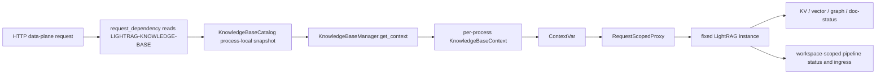
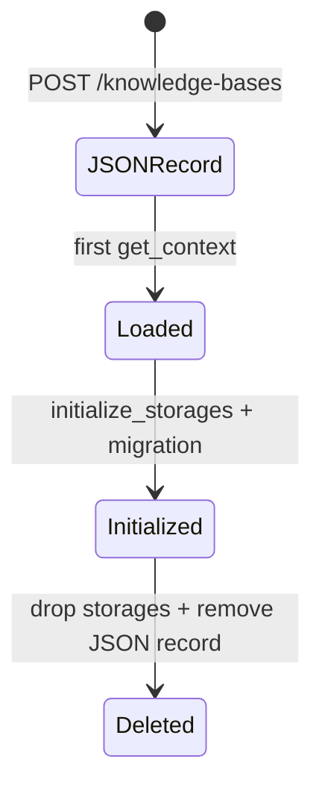
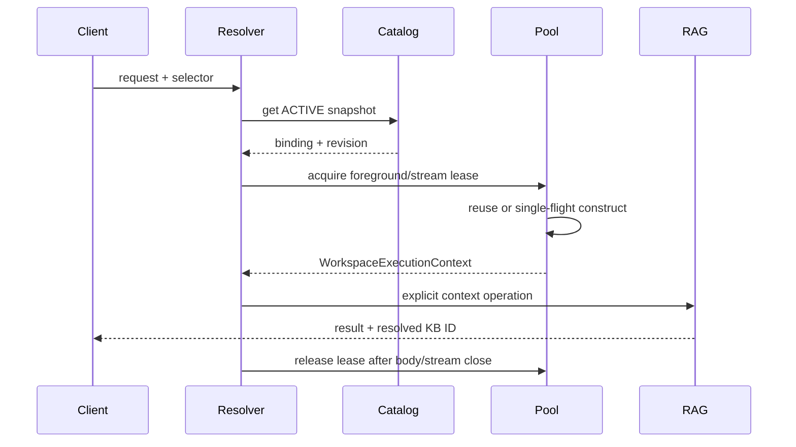

# LightRAG 多知识库 RFC 实现差距与新一轮优化方案

- 状态：架构决策已确认；Phase 0～2 已完成，Phase 3 待实施
- RFC 基线：`docs/lightrag-rfc-en.md`（2026-07-29）
- 代码基线：`dev@64713519`，已包含 `upstream/main@301e715c`
- 审计日期：2026-08-03（Asia/Shanghai）
- 目标：把当前集成实现收敛为可分阶段提交、可证明安全、可回滚的社区方案

> 实施进度（2026-08-03）：`3d79281c` 已完成 immutable tagged
> `WorkspaceBinding`、`legacy-v1`/`namespace-v1`、全 23 个可选 backend 的
> legacy codec 注册、12-storage descriptor construction/post-connect gate、
> destructive pre-delete gate，以及 multi/legacy workspace override startup audit。
> 本文第 5 节的 G-03/G-04 保留为基线审计记录；其 Phase 1 范围已由该提交关闭，
> `638a778d` 已继续完成 Phase 2：local/PostgreSQL `CatalogProvider`、revision/CAS、
> 分页和唯一约束、幂等 create/delete、CREATING～TOMBSTONED 状态机、operation
> journal、fencing、ACTIVE 数据面门禁、独立 Admin API Key 和有限 `Prefer: wait`。
> lease pool、显式 execution context、跨 workspace recovery 与调度仍按 Phase 3～5 实施。

## 1. 结论

当前实现已经证明了“一个固定 `LightRAG` 实例对应一个 workspace”这条主路径可行，也已经具备显式知识库创建、REST header 路由、默认文件存储隔离、外部存储 profile、WebUI 选择器以及较完整的单 workspace 管线互斥能力。合并最新社区主线后，管线还新增了 workspace-scoped ingress、分页调度、恢复 fence、扫描 job store，以及 Gunicorn 下的 provider 全局并发槽位，这些都可以成为新架构的可靠基础。

但当前实现仍不能宣称为 RFC 所定义的生产级多 workspace 服务，尤其不能宣称 Gunicorn 多 worker 安全。核心原因不是数据读写函数少传了一个 workspace，而是控制面、生命周期和资源治理尚未形成端到端安全闭环：

1. catalog 是每个进程独立加载的 JSON 快照，管理变更不能可靠地跨 worker 传播，并发写可能丢失更新；
2. catalog 没有 `CREATING/MIGRATING/ACTIVE/DELETING/TOMBSTONED`、revision、CAS 和 fencing，创建、迁移和删除不是可恢复事务；
3. `/health` 和普通首次数据访问会构造实例并执行迁移，观测请求具有写副作用；
4. pool 只有数量上限，没有资源权重、lease、LRU、安全淘汰、失败退避和正确的 `503` 背压语义；
5. `ContextVar` 缺失会静默回退 default，显式空 header 也会回退 default；后台任务没有显式 background lease；
6. storage override 的保护只覆盖部分动态知识库路径，没有在启动时证明四类 storage 的实际 effective workspace 一致；
7. 最新上游的 Gunicorn 全局 provider 槽位能够限制跨进程总并发，但单进程的多个 `LightRAG` 实例仍各自创建队列，且公平单位不是 workspace；
8. 没有 catalog-driven 的全 workspace 启动恢复、全局 active-pipeline 上限和 workspace 公平调度；
9. Ollama `model` 尚不参与知识库选择，标准 Ollama 客户端无法可靠选择非默认知识库；
10. 删除直接 drop 后移除 catalog 记录，没有 tombstone、可续跑 operation journal 和跨 worker 排他所有权。

因此，建议保留当前分支作为设计验证与回归样本，不在其上继续叠加大功能。后续实现应按照本文第 10 节拆分，每一阶段先建立不变量和故障测试，再开放相应数据面能力。

## 2. 审计范围与证据边界

本轮审计覆盖以下当前代码：

- `lightrag/api/knowledge_bases.py`：catalog、实例管理、request binding、删除；
- `lightrag/api/lightrag_server.py`：默认实例、动态实例 factory、lifespan、`/health`、router 注入；
- `lightrag/api/routers/knowledge_base_routes.py`：管理 API；
- `lightrag/api/routers/{document,query,graph,ollama_api}.py`：数据面选择与后台任务；
- `lightrag/lightrag.py`：12 个 storage object 的构造、provider wrapper、storage 初始化；
- `lightrag/pipeline.py`：workspace snapshot、管线 reservation、恢复扫描和 bounded scheduling；
- `lightrag/kg/{shared_storage,pipeline_ingress,scan_job_store,storage_profiles}.py`：同机协调、消息入口、扫描状态和物理 profile；
- 默认文件存储及 PostgreSQL、Redis、Neo4j、MongoDB、Milvus、Qdrant、Memgraph、OpenSearch 的 workspace 解析代码；
- `tests/api/test_knowledge_bases.py` 与 `tests/workspace/test_file_storage_multitenant_e2e.py` 等现有隔离回归。

审计结论只描述当前代码已能证明的能力。本文提出但尚未落地的 catalog provider、lease、fencing、迁移 coordinator、公平 scheduler 和 Ollama alias 均标记为“拟议设计”，不能在发布说明中写成已支持。

## 3. 当前代码模型

### 3.1 当前请求链路



关键行为如下：

- header 缺失时，`validate_knowledge_base_id()` 选择公共 ID `default`；
- catalog record 保存 `id/name/effective_workspace/isolation_level/storage_profile_id`；
- 每个非默认 record 懒创建一个新的 `LightRAG` 和 `DocumentManager`；
- `LightRAG` 构造时把同一个 `self.workspace` 传给 12 个 storage object；
- router closure 仍持有 proxy，proxy 根据当前 `ContextVar` 转发到选定实例；
- 管线主路径把 `self.workspace` 快照为 `run_workspace`，并据此获取 `pipeline_status`、lock 和 ingress。

这个模型已经避免了“在一个活跃实例上修改 workspace 字段”的主要竞争条件，但 ContextVar proxy 和生命周期管理仍让实例绑定依赖隐式上下文，尚未达到 RFC 的显式 lease 契约。

### 3.2 当前控制面



当前没有持久化的中间状态。`POST` 成功只说明 JSON record 已写入，不说明 storage 初始化或迁移成功；第一次 query/upload/health 才可能发现失败。删除失败时也没有 durable operation 记录供另一个 worker 接管。

### 3.3 最新上游可以复用的能力

最新 `upstream/main` 提供了以下重要基础，但其边界主要是“单 workspace 管线可靠性”：

- `pipeline.py` 在一次 run 入口固定 `run_workspace`，避免协调 namespace 在运行中漂移；
- `pipeline_ingress.py` 为每个 workspace 提供 bounded document channel、auto-rescan 和 sticky manual retry；
- `pipeline_status` 已有 owner token、recovery fence、manual freeze、pending enqueue 等互斥协议；
- doc-status 支持严格分页读取、状态恢复和 admission count；
- scan job store 有 owner/version/CAS、容量和 lease，但目前是进程内或同机 Manager 内存态，不是服务重启后的 durable catalog operation；
- Gunicorn 启动会从 `MAX_ASYNC_*` 构建跨 worker global slot，provider wrapper 有 lease、heartbeat 和回收；
- provider queue 已按 role/priority 区分交互和处理工作，但没有 workspace-aware fair queue。

后续设计应将这些能力包装进 workspace catalog、execution context 和 coordinator 契约，而不是重写管线内部已解决的问题。

## 4. RFC 逐项差距矩阵

状态定义：`已覆盖`表示当前证据足以满足 RFC；`部分覆盖`表示主路径存在但安全闭环不完整；`缺失`表示尚无对应实现；`方向冲突`表示当前行为与 RFC 明确相反。

| RFC 主题 | 状态 | 当前实现证据 | 主要差距 |
| --- | --- | --- | --- |
| 实例终身固定 workspace | 部分覆盖 | manager 为每个 record 创建独立 `LightRAG`；pipeline 入口快照 `self.workspace` | `KnowledgeBaseContext` 可变；核心仍通过有 default fallback 的 proxy 取实例；无不可变 binding 对象和构造后校验 |
| 显式创建、unknown 不 auto-create | 基本覆盖 | data plane 只调用 catalog `get`，创建只在 management POST | create 直接发布可访问 record，没有 lifecycle/idempotency/admin 边界 |
| 公共 ID 与展示名分离 | 已覆盖 | ID 为 `kb_<random>`，name 仅展示 | effective workspace 仍是无类型原始字符串，缺少 versioned codec 和 reserved identity model |
| selector 错误语义 | 方向冲突 | invalid 多数转 404；unknown 404 | present-empty/whitespace 变成 default；invalid 应为 400；未返回 resolved-ID response header |
| 四类 storage 使用同一 effective workspace | 部分覆盖 | 12 个 storage object 都收到实例 workspace；动态 logical 会拒绝 active backend override | 不是启动检查；default/已有 catalog record 可绕过；storage object 无 descriptor，无法证明实际解析结果一致 |
| legacy default 零搬迁升级 | 部分覆盖 | default record 保留 `args.workspace`，catalog mismatch 会启动失败 | 无 `LegacyDefault` tagged identity/codec；空值、`default`、`_` 的 backend 表示仍不统一 |
| shared durable catalog | 缺失 | JSON 使用原子文件替换和线程锁 | worker 各自快照；无跨进程锁、reload/revision/CAS；并发管理请求可丢更新 |
| catalog 生命周期 | 缺失 | record 只有元数据和时间 | 无 CREATING/MIGRATING/ACTIVE/DELETING/TOMBSTONED/ERROR、operation、fencing、幂等键 |
| per-worker bounded pool | 部分覆盖 | 每 worker contexts map、单 ID initialization lock、数量上限 | 无 entry 状态、resource weight、LRU/TTL、lease、安全 eviction、失败 backoff；满载返回 409 而非 503 |
| request/stream/background context | 部分覆盖 | ContextVar 可隔离普通并发 request；async task 会复制上下文 | 缺上下文时回退 default；active_requests 不覆盖 background；无 handoff、取消 exactly-once release 证明 |
| workspace-scoped pipeline | 大体覆盖 | `pipeline_status`、lock、ingress、doc-status、scan store 均以 `rag.workspace`/`run_workspace` 选取 | API/后台工作仍依赖 proxy；协调 contract 未包含 catalog revision/binding/fencing |
| 全 catalog restart recovery | 缺失 | 单 workspace 被显式触发时能扫描并恢复 interrupted status | startup 仅初始化 default；非默认 workspace 不访问就不恢复；无 catalog 分页、恢复 lease、跨 workspace scheduler |
| pipeline 并行与全局上限 | 部分覆盖 | 每 workspace 有单 writer；不同实例可并行 | 无 server-global active-pipeline cap、per-workspace pending cap 和公平 admission |
| provider deployment-wide limit | 部分覆盖 | Gunicorn global slots 可限制 LLM/embedding/rerank 跨 worker总量 | 单进程多实例每实例单独 queue，形成 N×C；Gunicorn 公平粒度是进程/role，不是 workspace |
| Gunicorn 任意 worker 路由 | 方向冲突 | 实例 pool 本就 per worker；pipeline Manager state 同机共享 | catalog 不是共享真相；worker B 看不到 worker A 新建/重命名/删除；无 revision invalidation |
| clustering 演进 | 部分覆盖 | shared storage 的 slot/owner/heartbeat 可作为同机实现参考 | business logic 直接依赖 Manager；catalog、migration、delete、pipeline ownership 没有统一 coordinator provider |
| side-effect-free health/readiness | 方向冲突 | `/health` 直接 `get_context(knowledge_base_id)` | 会构造实例、初始化 storage、迁移、创建 pipeline/ingress state；没有独立 `/ready` 和 pool peek |
| migration timing | 方向冲突 | default 在 startup 迁移 | 非默认在首次 `get_context()` 迁移；create 未迁移；无多 worker owner/fence/进度 |
| REST route coverage | 大体覆盖 | document/query/graph/Ollama data routes 注入统一 dependency，OpenAPI 有 header 测试 | 缺 route policy registry；`supported_file_types` 仍写旧 `LIGHTRAG-WORKSPACE` Vary；health 分类错误 |
| Ollama model alias | 缺失 | chat/generate 只能依赖 custom header | `request.model` 未映射 catalog；标准客户端无法选择非默认库；无 selector conflict |
| authorization 边界 | 部分覆盖 | 有 server-wide API key/JWT；文档已说明 isolation != authorization | management create/delete 只要求普通 combined auth，不是 admin；无 authorizer hook/unknown-selector rate limit |
| 两阶段删除与 tombstone | 缺失 | 删除会检查 request count/pipeline busy，并尝试 drop 全部 storage | reservation 与 request count 不是统一 lease；无 CAS/fence/tombstone；部分 drop 后失败可能留下不可判定状态 |
| observability | 部分覆盖 | health 有 pipeline/provider queue 与 selected workspace 信息 | health 本身有副作用；缺 catalog revision lag、pool lease/state、migration owner、workspace fairness、recovery backlog |
| WebUI 与 physical profile | 已有实验实现 | WebUI 可显示 name+ID；profile 覆盖多个 backend | 实现顺序早于 core RFC；profile 验证资源字段但不能替代 canonical identity/descriptor/fencing |

## 5. 高优先级 Gap 的代码含义与风险

### G-01：catalog 不是跨 worker 的控制面真相（P0）

当前 `KnowledgeBaseCatalog` 在进程启动时把 JSON 全量读入 `_records`，后续 `get/list` 都读取这份内存 map。`threading.RLock` 只能保护同一个进程；原子文件替换只能避免半写文件，不能阻止两个 worker 基于各自旧快照先后覆盖。

典型事故：worker A 创建 `kb_a` 并写文件，worker B 的快照仍没有它，因此同一个客户端下一次请求被负载均衡到 B 时得到 404。若 B 随后创建 `kb_b`，它写出的文件可能不含 `kb_a`，形成 lost update。更严重的是 A 仍可继续访问已被 B 删除的旧 record。

目标设计：引入 `CatalogProvider`，所有 mutation 使用 revision/CAS；worker cache 只保存带 revision 的快照。生产 Gunicorn 第一版建议使用 PostgreSQL provider；本地 JSON provider 明确仅支持 `workers=1`，配置为多 worker 时启动失败。

验收：两个真实进程用 barrier 同时 create/rename/delete，最终 catalog revision 单调、无记录丢失；任意 worker 在有限时间内观察到变更；无需 sticky session。

### G-02：record 没有生命周期，创建和删除不是可恢复操作（P0）

当前 `POST /knowledge-bases` 写完 JSON 就返回 201，此时 storage 尚未初始化。第一次业务请求同时承担 initialize、migration 和错误暴露。删除则先逐个 `drop()`，最后才移除 record；中途失败时 catalog 仍看起来是普通可访问 record。

目标设计：record 状态机为：

```text
ABSENT -> CREATING -> MIGRATING -> ACTIVE
ACTIVE -> DELETING -> TOMBSTONED
CREATING/MIGRATING/DELETING -> ERROR
```

每个 transition 带 `revision`、`operation_id`、owner、fencing token、schema version、retry metadata 和 idempotency key。只有 ACTIVE 可进入 data plane。TOMBSTONED ID 永不自动复用。

创建建议返回 `202 Accepted + operation_id`，或在显式 `wait=true` 且短时间完成时返回 ACTIVE；不能在尚未验证四类 storage 时发布 ACTIVE。

### G-03：workspace identity 只是原始字符串（P0）

当前 public `default` record 的 effective workspace 等于 `args.workspace`，可能为空。各 backend 对空 workspace 的历史表达不同：文件存储使用根目录，Redis KV 无前缀，PostgreSQL 常回退 `default`，Qdrant 使用 `_`。因此“所有对象收到同一个 Python 字符串”不等于“它们使用同一个逻辑身份且物理布局不会碰撞”。

目标设计使用不可变 tagged binding：

```text
WorkspaceBinding {
  public_id,
  kind: LegacyDefault | Named,
  canonical_key,
  codec_version,
  storage_profile_id,
  catalog_revision
}
```

- `LegacyDefault + legacy-v1` 保持各 backend 原有物理布局，不搬迁数据；
- 新 record 使用 `Named + namespace-v1`，canonical key 由服务生成；
- display name 永不进入 table/collection/path；
- `default`、空、`_`、内部前缀被 identity 层保留；
- 构造后每个 storage 返回无 secret 的 `StorageNamespaceDescriptor`，四类 family 必须报告相同 canonical binding 和 codec。

### G-04：storage override 保护不完整（P0）

`KnowledgeBaseManager._profile_for()` 会在创建/访问动态 logical record 时检查 active backend 的 override 环境变量，这是有价值的局部保护。但它没有在 server startup 枚举 catalog 和四类 storage；default 仍可接受 backend override；不同 family 的 override 可以不同；已有 record 直到首次访问才报错。

目标规则：

- multi-workspace mode：任一 active backend 的 workspace override 非空，启动直接失败，并列出变量名但不打印 secret；
- legacy single-workspace mode：保留历史优先级，但必须构造 descriptor 并证明 KV/vector/graph/doc-status 的 canonical key 一致；不一致同样 fail-fast；
- storage profile 只选择连接资源，永远不能改 canonical workspace；
- destructive operation 在 descriptor mismatch 时必须拒绝，不能猜测要 drop 哪个 namespace。

### G-05：隐式 default fallback 会把编程错误变成串库（P0）

`RequestScopedProxy._target()` 使用 `_current_context.get() or default_context`。这让旧 closure 易于接入，但当新 route、background task 或 stream 忘记绑定 context 时，请求不会失败，而是静默读写 default。`validate_knowledge_base_id()` 也把 `None`、空字符串和全空格合并为 default。

目标设计：

- 仅 API boundary 能把“header 完全缺失”解析为 default；
- header 存在但为空/空格/非法时返回 400；合法但未知返回 404；
- core proxy 无 default，缺 context 抛 `WorkspaceContextMissingError`；
- 新 core API 显式接收 `WorkspaceExecutionContext`，proxy 只作为过渡适配器并逐步删除；
- 成功响应返回 resolved public ID，便于客户端检测代理或缓存路由错误。

### G-06：request count 不是完整 lease（P0）

当前 `active_requests` 只在 dependency context manager 内加减。`asyncio.create_task()` 会复制 ContextVar，因此后台任务可能仍能找到正确实例，但父 request 结束后 count 已归零。未来 eviction/delete 会认为实例空闲，后台任务却仍在使用它。

目标设计：pool `acquire()` 返回不可复制的 lease handle，分别计数 foreground、stream 和 background。后台任务必须在 request lease 释放前执行原子 handoff：先取得 background lease，再发布任务。stream lease 直到 generator close/cancel 才释放。所有释放使用幂等 token，保证取消路径 exactly once。

### G-07：pool 是“只进不出”的数量闸门（P1）

当前 `_contexts` 达到 `LIGHTRAG_MAX_LOADED_KNOWLEDGE_BASES` 后永久拒绝新的知识库，除非删除知识库或重启。上限没有考虑一个实例持有多少数据库连接、parser thread 和 provider queue；返回 409 也把临时容量问题误报为业务冲突。

目标 pool entry 状态：

```text
INITIALIZING -> READY -> DRAINING -> FINALIZING -> EVICTED
      |           |          |             |
      +---------> FAILED <----+-------------+
```

pool 同时限制 instance count 和 resource weight。淘汰只选择 foreground/background lease 均为 0、无 pipeline/migration/recovery/delete、无 buffered work 的 idle LRU。无安全 victim 时返回 `503 workspace_capacity_exhausted` 和 `Retry-After`。失败 entry 使用指数退避和有界 failure cache，避免重试风暴。

### G-08：`/health` 和首次数据访问会迁移（P0）

当前 `/health` 直接调用 `knowledge_base_manager.get_context()`；非默认 record 会在 `_initialize_context()` 中执行 `initialize_storages()` 和 `check_and_migrate_data()`。这意味着探针可能打开数据库连接、创建 pipeline namespace、修改 schema，并与业务请求竞争 migration。

目标 endpoint policy：

| 类别 | catalog | 可 load instance | 可迁移/创建 |
| --- | --- | --- | --- |
| `/health`、version | 不查 workspace | 否 | 否 |
| `/ready`、catalog/pool status | 只读 snapshot | 否 | 否 |
| management create/delete | 显式目标 | lifecycle worker 可 load | 是，带 operation/fence |
| data read/write | 只接受 ACTIVE | 可 acquire existing binding | 否 |
| runtime observation | catalog/coordinator/pool peek | unloaded 时不 load | 否 |

每个 route 必须登记 policy class；OpenAPI 测试发现未分类 route 就失败。

### G-09：没有全 catalog 的重启恢复（P0）

当前 startup 只初始化 default。非默认 record 中的 PENDING/PROCESSING 文档只有在有人再次访问并触发 pipeline 时才恢复。上游 ingress 和 scan job store 能提高一次运行期间的可靠性，但 Manager mailbox 在整服务重启后不是 durable truth。

目标恢复 coordinator：分页枚举 ACTIVE/MIGRATING/DELETING/ERROR record，为每个 workspace 获取 recovery lease 和 fencing token，读取 durable doc-status/operation journal，回收 stale PROCESSING，并通过全局 scheduler 提交。恢复有 checkpoint、bounded parallelism；一个坏 workspace 不阻塞其他 workspace。

### G-10：provider 总并发只在 Gunicorn 路径部分统一（P0）

上游 Gunicorn global slot 是重要进展：相同 `concurrency_group` 在不同 worker 之间共享总上限。但单进程模式会 bypass global gate，每个 `LightRAG` 又各自包装 embedding/rerank/role LLM queue，因此加载 N 个 workspace 仍可能达到 N×C。Gunicorn slot 的等待公平主要以进程和 role 为单位，也不能保证 workspace B 不被 A 的批量 ingest 饿死。

目标 `ResourceAdmissionController` 是 service-level 单例，所有实例只提交工作项：

```text
(workspace_id, resource_kind, operation_kind, cost_hint, priority, cancellation)
```

单进程使用共享 in-process scheduler；Gunicorn 使用同机 coordinator 的全局 token；未来多节点使用外部 lease provider。调度采用 DRR/weighted round-robin + priority aging，保留有界 query share，同时保证 ingestion 最终前进。配置值 C 在所有模式都表示 deployment total，而不是 per instance/per worker。

### G-11：没有跨 workspace 的 active-pipeline cap 和公平性（P1）

当前每个 workspace 能各自持有 `busy`，所以多库可并行，这是正确方向；但激活 N 个库可同时启动 N 条 ingestion pipeline。provider slot 虽能限制最终模型调用，parse、chunk、DB connection 和内存仍可能先被大量任务占满。

目标 scheduler 先获取全局 pipeline token，再进入 workspace 单 writer。ready queue 按 workspace 分区，限制 server active pipelines、per-workspace pending jobs 和 global pending jobs；超载返回稳定 429/503。公平验收使用服务份额和最大等待时间，不用“看起来有 semaphore”代替。

### G-12：Gunicorn 仍依赖进程本地 catalog，且 coordinator 契约不完整（P0）

当前 pipeline status、ingress 和 provider slot 已能通过同机 Manager 共享，但 catalog、migration ownership、delete ownership 和 pool revision 不共享。连接成本也近似 `workers × loaded workspaces × backend clients`，当前 health 未给出这个预算。

目标支持矩阵：

| 模式 | catalog | coordinator | 支持结论 |
| --- | --- | --- | --- |
| 单 worker standalone | local file 或 shared provider | in-process | 首阶段支持 |
| Gunicorn 同机 | PostgreSQL shared catalog | Manager coordinator adapter | 完成 kill/recovery/fairness 测试后支持 |
| 多节点 | shared catalog | external lease/admission provider | 后续，不在首阶段宣称 |

业务层只依赖 lease/CAS/fence/admission protocol，不直接依赖 Manager dict。任何不满足矩阵的组合启动失败，不能静默降级为 per-worker 语义。

### G-13：Ollama 客户端不能用 model 选库（P1）

当前 `/api/chat` 和 `/api/generate` 使用统一 context dependency，因此能接收 custom header；但许多标准 Ollama client 只能可靠控制 JSON body 的 `model`。现有代码仍把 model 当模拟模型名，不解析 catalog alias。

目标 alias：`lightrag:latest`/`lightrag:default` 指向 default，`lightrag:<knowledge-base-id>` 指向 ACTIVE record。unknown 返回 Ollama-compatible not found 且不创建；model alias 与 header 同时存在且不一致返回 400 `selector_conflict`。`/version`、`/tags`、`/ps` 只读 catalog snapshot，不实例化所有 workspace。

### G-14：删除不是 fenced 两阶段操作（P0）

当前删除先把 ID 放入进程本地 `_deleting_ids`，然后查看本 worker 的 request count 和共享 pipeline flags。另一个 worker 仍可能接受新 request；后台任务 count 不完整。逐 storage drop 的中间失败也可能造成部分 family 已清空、部分未清空。

目标流程：CAS ACTIVE→DELETING；全 worker 拒绝新 lease；等待 lease drain；获取 exclusive deletion lease/fencing token；核对四族 descriptor；逐步记录 cleanup journal；清理 input/artifact；最终 TOMBSTONED。失败保持 DELETING/ERROR 并可用同一 operation 恢复，绝不重新 ACTIVE 或复用 ID。

### G-15：隔离与授权仍只有服务级边界（P1/明确 non-goal）

当前任意通过 server-wide auth 的普通用户都能列出、创建、选择和删除知识库。RFC 第一阶段可以不做 per-workspace ACL，但 management mutation 至少需要明确的 admin policy，且应预留 `WorkspaceAuthorizer(principal, action, record)` hook。公开文档必须说明 ID 不是 secret，selector 不是权限证明。

## 6. 拟议目标架构

```mermaid
flowchart TB
    R["Request / lifecycle operation"] --> S["Selector + authentication + optional authorizer"]
    S --> C["Shared CatalogProvider: revision/CAS/lifecycle"]
    C --> P["Per-worker InstancePool"]
    P --> L["Foreground/stream/background lease"]
    L --> X["Immutable WorkspaceExecutionContext"]
    X --> I["Fixed LightRAG instance"]
    I --> D["Storage descriptors: KV/vector/graph/doc-status"]
    X --> Q["Workspace pipeline owner lease"]
    Q --> F["Global fair pipeline scheduler"]
    I --> A["Shared ResourceAdmissionController"]
    C --> M["Migration/recovery/deletion coordinator"]
    M --> Q
```



### 6.1 组件职责

`CatalogProvider`

- 持久化 identity、binding、lifecycle、schema version、revision、operation 和 tombstone；
- 提供 CAS、幂等 create、分页 list 和 revision watch/poll；
- local provider 只用于单 worker；shared provider 才允许 Gunicorn。

`WorkspaceResolver`

- 区分 header absent、present-empty、invalid、unknown、inactive；
- 在 auth 后、pool acquire 前执行 future authorizer；
- 返回 immutable catalog snapshot，不直接返回 raw workspace string。

`InstancePool`

- 每 worker 保存 live clients；single-flight 构造；
- 管理 entry 状态、lease、resource weight、LRU、failure backoff；
- 使用 catalog revision 发现 stale entry；删除/配置变化时 drain；
- pool `peek` 不构造实例。

`StorageBindingValidator`

- 在 ACTIVE 前收集四类 storage descriptor；
- 核对 canonical identity、codec、profile 和物理 fingerprint；
- multi-workspace 下禁止 override；destructive operation 前再次验证。

`WorkspaceCoordinator`

- 提供 lease acquire/renew/release、TTL、owner、fencing、CAS、通知；
- 覆盖 pipeline、migration、recovery、deletion 和 global admission；
- local、same-host Manager、future external provider 共享同一协议。

`ResourceAdmissionController`

- deployment-wide 控制 LLM/embedding/rerank 和 active pipelines；
- 以 workspace 为队列分区，支持 DRR、aging、query reserved share；
- 统一取消、超载、指标和 retry semantics。

### 6.2 典型 data request 时序



任何 ordinary data request 都不能调用 catalog create、storage migration 或 lifecycle transition。

## 7. 关键 ADR

### ADR-I01：固定实例，不支持 mid-life workspace switch

选择：一个实例绑定一个 immutable `WorkspaceBinding`，切换通过 pool acquire 另一个实例完成。

原因：storage clients、provider queue、parser executor、async generator、buffer 和后台任务都可能跨 await 存活，修改一个实例字段无法原子更新这些对象。

### ADR-I02：双模式兼容，而不是强迫旧部署立即迁移

选择：

- legacy mode 保持 no-header/no-WORKSPACE 的现有物理布局；
- multi-workspace mode 采用 catalog + canonical binding，并禁止 backend workspace override；
- default record 通过 `LegacyDefault/legacy-v1` 显式表达历史布局，不重命名、不复制、不重嵌入。

### ADR-I03：PostgreSQL 作为首个 shared catalog provider

选择：local JSON provider 仅支持单 worker；生产 Gunicorn 第一版实现 PostgreSQL provider。

原因：catalog 需要事务、unique constraint、CAS revision、operation journal、分页和 durable tombstone。Redis 可作为 coordinator/admission provider，但把 catalog 唯一真相首先放在 PostgreSQL 更容易保证持久性和审计。若维护者要求无外部依赖的多 worker，再单独评估 SQLite/WAL 的支持矩阵，不能默认宣称网络文件系统安全。

### ADR-I04：ContextVar 只做 carrier，不做 authority

选择：authority 是 lease-owned `WorkspaceExecutionContext`；ContextVar 便于日志和兼容 adapter，但没有 default。所有 background spawn 必须 handoff。

### ADR-I05：复用上游 pipeline ingress，不把它误当 durable catalog

选择：保留 workspace ingress、bounded scheduling、recovery fence 和 doc-status strict scan；外层增加 catalog-driven recovery、pipeline owner lease 和 global fair scheduler。

### ADR-I06：复用 Gunicorn global slots，提升为全模式 admission

选择：保留现有 concurrency group、heartbeat/reap 机制；把 queue ownership 从每实例提升到 service scope，work item 增加 workspace/operation/cost；单进程也使用同一个 controller。

### ADR-I07：只在 ACTIVE 进入数据面

选择：create/migrate/recover/delete 是 control-plane operation；health/readiness 和普通 query/upload 不拥有 migration 权限。

### ADR-I08：physical profile 延后硬化，不阻塞 core

选择：当前 physical/WebUI 能继续作为 fork 特性，但社区 PR 按 canonical identity、catalog、pool、pipeline、Ollama、WebUI、backend physical 的顺序拆分。profile 只选择资源，不覆盖 workspace identity。

## 8. API 与失败契约

### 8.1 REST selector

| 输入 | 结果 | 副作用 |
| --- | --- | --- |
| header 完全缺失 | 选择 reserved default | 只可 load ACTIVE default，不创建 |
| header 存在但空/空格 | 400 `invalid_selector` | 无 |
| 语法非法 | 400 `invalid_selector` | 无 |
| 合法但未知 | 404 `workspace_not_found` | 无 |
| CREATING/MIGRATING/RECOVERING | 503 + Retry-After | 无 data access |
| DELETING/TOMBSTONED | 409/410 | 无 load |
| pool 无安全容量 | 503 `workspace_capacity_exhausted` | 不超配、不取消在途任务 |

成功数据响应应加入 canonical response header，例如 `LIGHTRAG-KNOWLEDGE-BASE: <resolved-id>`。stream 在 response start 前固定该值。

### 8.2 route policy

- `/health` 不接收或不解释 selector，只返回 process liveness；
- `/ready` 只读 catalog/coordinator snapshot；
- `/knowledge-bases` 管理面通过 path/body 指定 record，不使用 data selector；
- document/query/graph/cache/pipeline data routes 使用统一 resolver；
- workspace runtime observation 使用 pool peek，返回 `UNLOADED` 而不是构造；
- route policy registry 和 OpenAPI test 保证新增 endpoint 不会漏分类。

### 8.3 管理授权

第一阶段仍可维持“所有 data workspace 共享服务级 auth”，但 create/update/delete/retry-migration/force-recovery 必须走 admin dependency。若当前账号体系无法表达 admin，至少在 API-key-only 模式限定 management mutation，并把限制写入支持矩阵。

## 9. 迁移、恢复与回滚

### 9.1 升级流程

1. 启动前 preflight 只读计算四类 backend、override、legacy physical fingerprint 和碰撞；
2. bootstrap catalog schema，使用 shared lease 保证一个 owner；
3. 幂等创建 public `default` record，绑定现有 `WORKSPACE`/legacy codec；
4. 默认 storage migration 在 readiness 前完成；
5. 非默认 record 由 bounded startup reconciler 迁移，期间状态为 MIGRATING；
6. data plane 对非 ACTIVE record 返回稳定 503，不在 first request 重试迁移。

### 9.2 回滚

- canonical identity PR 不重写 default 物理 namespace，因此可关闭 multi-workspace routing 后继续使用旧 default；
- catalog schema 在一个 release window 内只做 additive change；
- 非默认 record 的新数据不会自动合并到 default；回滚前必须明确这些数据暂时不可达；
- destructive lifecycle 上线前必须备份 catalog 和对应 storage；
- 每个 implementation phase 都保留 feature flag，直到其 failure-injection suite 通过。

### 9.3 运行中恢复

- worker crash：lease TTL 到期，新的 owner 以更高 fencing token 接管；旧 owner 的 late commit 被拒绝；
- service restart：catalog reconciler 扫描全部未终态 operation 和 ACTIVE workspace 的 interrupted doc-status；
- partial delete：保持 DELETING/ERROR，按照 journal 继续；
- provider/controller 暂时不可用：fail closed，释放本地 token，返回可重试错误，不扩大并发；
- catalog 不可用：liveness 可健康，readiness degraded，data/management fail closed。

## 10. 建议实施阶段与 PR 边界

### Phase 0：支持矩阵、feature gate 与基线测试

范围：冻结 legacy/multi-workspace mode；建立 route policy registry、现状 sentinel、配置 preflight dry-run 和 metrics skeleton。

验收：不改变 default 数据布局；当前 standalone 58 个隔离回归继续通过；不受支持的 workers/catalog/coordinator 组合启动失败。

### Phase 1：canonical binding 与四族 storage 一致性

范围：tagged identity、codec、reserved names、storage descriptor、override startup audit、default zero-copy bootstrap。

非目标：动态 catalog routing、WebUI、physical resource provision。

验收：所有 backend fake/unit descriptor matrix；真实 backend override/mixed-family integration；相同 doc ID 的 doc-status sentinel。

### Phase 2：shared catalog 与 lifecycle

范围：provider contract、PostgreSQL provider、revision/CAS、idempotent create、state machine、operation journal、tombstone、admin management API。

非目标：开放非默认 data write。

验收：真实多进程 concurrent create/update/delete；kill lifecycle owner；catalog revision/cache invalidation；local provider + workers>1 fail startup。

### Phase 3：lease pool 与 read-only routing

范围：immutable execution context、foreground/stream/background lease、single-flight entry、resource weight、safe LRU、failure backoff、selector semantics、health/ready/pool peek、resolved response ID。

非目标：多 workspace ingestion；该阶段只开放 query/read 或 feature-gated smoke path。

验收：barrier 首次构造一次；stream/background 阻止 eviction/delete；present-empty 400；health 产生零构造/迁移；满池 503。

### Phase 4：pipeline context、迁移与全 catalog recovery

范围：显式 background handoff、catalog-driven migration/recovery、pipeline owner lease/fence、durable destructive journal；接入已有 ingress/bounded scheduling。

验收：多 workspace worker kill/full restart；同 content hash 不串 doc-status；一个坏 workspace 不阻塞其他；旧 owner late commit 被拒绝。通过后才开放非默认 upload/scan/mutation。

### Phase 5：全模式 shared admission 与公平 scheduler

范围：service-level LLM/embedding/rerank controller、global active-pipeline cap、workspace DRR/aging、single-process 与 Gunicorn adapters、bounded overload。

验收：N workspace 峰值仍不超过 C；持续 A 负载下 B 在约定时间获得服务；query reservation 不永久饿死 ingestion；queue saturation 无内存增长。

### Phase 6：Ollama selector

范围：model alias、header/model conflict、tags/ps observation、compatibility errors。

验收：不带 custom header 的标准 client 可选择非默认 ACTIVE record；unknown 不创建；metadata route 不 load instance。

### Phase 7：WebUI 与 physical backend hardening

范围：在 core contract 稳定后重接现有 WebUI；逐 backend 审核 profile resource ownership、provision/delete/migration/backup。

验收：每个 backend 独立小 PR；UI 第一项为新建独立库，列表显示 name+ID；UI 不把 display name 当 namespace。

### Later：external coordinator 与多节点

只有在 external lease/admission provider、网络分区、TTL/fencing、node kill 和 no-sticky-session 测试完成后，才更新支持矩阵为 multi-node。

## 11. 验证计划

### 11.1 必须新增的确定性测试

- selector：absent、present-empty、whitespace、invalid、unknown、inactive、conflict；
- catalog：两个进程 barrier 并发 mutation、CAS lost-update、revision invalidation、idempotency key；
- pool：single-flight、所有 entry leased 时背压、background/stream lease、取消 exactly once、failure backoff；
- storage：四族 descriptor 一致、每个 override fail-fast、legacy empty/default/_ 不碰撞；
- doc-status sentinel：A/B 插入相同内容，在 PENDING/PARSING/PROCESSING/PROCESSED/FAILED/retry/delete/restart 每阶段互不覆盖；
- lifecycle：create owner kill、migration owner kill、partial delete、stale fencing token；
- health：访问 health/ready 后构造计数和 migration 调用计数均为 0；
- recovery：全服务重启后无需用户访问，所有 ACTIVE workspace 都被分页发现；
- admission：single process 与 Gunicorn 的 LLM/embedding/rerank peak，active pipeline cap，workspace fairness；
- Ollama：model-only、unknown、header/model conflict、metadata side-effect-free；
- security：admin mutation、selector 不是授权、错误/log 不泄露连接信息、unknown probing rate limit。

并发测试使用 event/barrier 和 fault injection，不以长时间 `sleep` 推测竞态是否存在。

### 11.2 继续保留的现有回归

- `tests/api/test_knowledge_bases.py`：作为现有 API/固定实例行为基线，后续按新错误语义更新；
- `tests/workspace/test_file_storage_multitenant_e2e.py`：保留相同 content hash 的默认文件存储隔离；
- 各 `tests/kg/*_impl`：加入 descriptor/override/drop 安全用例；
- 上游 pipeline ingress、scan job、bounded scheduling 和 global slot 测试不得因外层重构退化；
- WebUI Bun tests 与 production build 作为 Phase 7 gate。

### 11.3 性能与可靠性指标

- catalog lookup/cache hit 的 p50/p95/p99，不因 workspace 数量线性扫描；
- pool 构造/淘汰耗时、连接权重、失败率；
- provider configured total 与 observed peak 必须相等或 observed 更低；
- 每 workspace scheduler wait time、service share、starvation count；
- recovery catalog scan cursor、backlog age、stale lease reclaim；
- metrics 中 workspace label 使用有界聚合，详细 ID 放 structured log/trace，避免 cardinality 爆炸。

## 12. 当前实现中可立即做的小修复与实施边界

以下问题可作为独立低风险修复，但不应被误认为已经补齐 RFC：

1. 把 `/documents/supported_file_types` 的 `Vary: LIGHTRAG-WORKSPACE` 改为 canonical `LIGHTRAG-KNOWLEDGE-BASE`；
2. 为 invalid selector 保留 400，而不是统一包装为 404；
3. 增加 resolved knowledge-base response header；
4. 将 local catalog + `workers>1` 标为不支持并启动失败；
5. 在文档中明确 management API 当前不是 per-workspace admin/ACL。

其中第 2、3 项会改变 API contract，第 4 项会改变部署可用性，仍应在用户/RFC 评审后按任务顺序实施。本轮只记录，不修改业务代码。

## 13. 已确认的架构决策

用户于 2026-08-03 确认按推荐方案实施：

1. PostgreSQL 是首个 shared catalog provider；local JSON 仅支持单 worker。
2. multi-workspace mode 下任一 active backend workspace override 都导致启动失败。
3. create/delete 默认采用幂等的 `202 + operation_id`，同时允许有限 `Prefer: wait`。
4. public selector 保持 `LIGHTRAG-KNOWLEDGE-BASE`；成功响应使用同名 header 返回 resolved public ID。
5. Ollama alias 使用 `lightrag:default` 与 `lightrag:<knowledge-base-id>`；header/model 冲突 fail closed。
6. 数据面按“纯 storage read → query → ingestion/write”开放；query 的 cache/provider/stream 副作用必须先完成审计。
7. management mutation 第一阶段使用独立 Admin API Key，长期演进为 JWT admin role 与 `WorkspaceAuthorizer`。
8. 首个安全 MVP 明确支持单 worker；shared catalog/coordinator 和故障测试完成后，再把同机 Gunicorn 加入支持矩阵。

## 14. 实施启动条件

业务代码按以下已确认 Gate 实施：

- 确认第 13 节至少前六项产品/兼容决策；
- 确认 Phase 1～4 的 PR 边界，尤其是 non-default ingestion 在 Phase 4 前保持 feature-gated；
- 确认 standalone 单 worker和 Gunicorn 的支持矩阵；
- 确认 legacy default 零搬迁与 backend override fail-fast 策略；
- 确认 catalog provider 与 management admin boundary。

上述评审已经完成。实施严格按照 `docs/lightrag-tasks.md` 的 RFC-I 任务推进；每项完成后必须先运行对应 deterministic tests、记录真实 pass/fail 和残余风险，再开始下一项；不得把后续 phase 的设计承诺提前写成当前能力。
